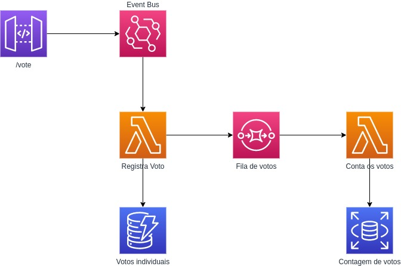

# SSS - Super Serverless Sample

Esse é um projeto de exemplo de arquitetura serverless usando como inspiração a votação para eliminação do paredão do BBB.
Nessas votações, o sistema da Globo recebe uma alta carga de execuções e precisa de uma arquitetura que consiga processar tudo isso.

## Arquitetura



Explicação sobre cada recurso utilizado
* API Gateway: recebimento das requisições através de uma API Rest e enviando de forma assíncrona para processamento, proporcionando um alto *throughput*
* EventBridge: poderoso broker de mensagens que permite a execução paralela de cada mensagem de forma massiva. Alta capacidade de processamento das mensagens no mesmo ritmo que é recebido
* DynamoDB: armazenamento dos votos individuais
* SQS: envio de mensagens em lotes para processo assíncrono de contagem dos votos. O envio de lotes proporciona uma contagem mais rápida. Ao mesmo tempo, o SQS permite um processamento alto e controlado para não sobrecarregar o banco de dados
* RDS (Aurora Serverless): armazenamento da contagem dos votos, permitindo o incremento do valor e emissão de relatórios de forma mais otimizada

## Executar

Esse projeto utiliza Serverless Framework para gerar a infraestrutura como código. Por esse motivo, fica fácil reproduzir essa aplicação em sua própria conta da AWS.

Basta executar o comando abaixo na raiz do projeto:
```
sls deploy
```

Antes de realizar uma chamada para o endpoint, você precisa criar uma tabela no seu banco de dados RDS:
```sql
create table vote_bag_count (id serial primary key, name text, vote_count integer, saved_at timestamp);
```

## Estatísticas

**Em breve.**